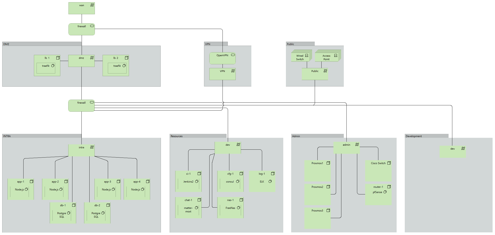

# Proxmox Virtual Environment
#### Puppet scripts for my home lab high-availability(HA) development environment.
My home lab environment for software development and infrastructure
that has a production like configuration that I use to learn and
practice on DevOps and software development. The setup is similar
to and handle some of the complexity that a IT-department would
need to meet the demands of a production, test and dev environment.

It configures a pretty standard high-availability environment with a
pair of reverse proxies that load balance in front of four backend
servers that has been divided in two clusters and using a primary
and hot-standby for stored state.

The network has been segmented into subnetworks for dmz and a internal
corporate network + more to emulate a production like environment.

#### Features
* Clustered proxmox virtual environment on three machines.
* Hardware failover with virtualized linux containers deployed on the proxmox cluster.
* Segmented network, divided into subnets and vlans for security
* Load balanced frontend servers.
* Load balanced node backend server.
* A sample web application.
* Immutable lightweight lxc containers with one dedicated task each. (debian8)
* Service discovery with consul, health check of nodes and services with consul
* Provisioning with puppet scripts for configuration and containers
* Centralized logging from all nodes to ELK stack
* Notifications of events to mattermost
* Continuous deployment, a build pipeline with Jenkins2

## Hardware
Three retired work laptops, Lenovo W520 and W530 with 16GB ram
 and old school spinning hard drives connected with a Cisco
 switch with VLAN support, [Cisco SG 200-08](https://www.amazon.co.uk/Cisco-SG200-08-8-port-Gigabit-SLM2008T-EU/dp/B004UOT4BI/ref=sr_1_2?ie=UTF8&qid=1473971098&sr=8-2&keywords=SG+200-08), for directing network
 traffic between them.

## Proxmox cluster on three nodes.
A screenshot from the Proxmox Web Admin. The three machines has
been added to the same cluster and can be managed through the
same admin console.

## Virtual machines overview with networks
This is how is looks like if modelled with Archimate and Archi.
I have modelled just the virtual machines, the networks and firewalls
that connect them.

## The sample application that is deployed
Is a very simple React application [Blogr](https://github.com/dniel/blogr-workshop)
that uses a Node Express backend and a PostgreSQL database for
persistence. Right now its deployed using the same puppet script
that install the configuration and system software but this
eventually be handled by Jenkins Pipeline.

## Configuration
#### [Network configuration](doc/setup_network.md) with [Pfsense](doc/setup_pfsense.md)
#### Container virtualization with [Linux LXC](doc/setup_lxc.md) and [Proxmox](doc/setup_proxmox.md) 
#### [Continuous Delivery with Jenkins Pipeline](doc/setup_jenkins.md)
#### [Service Discovery with Consul](doc/setup_consul.md)
#### Application orchestration with Rancher, TODO
#### Centralized logging with ELK, TODO
#### Centralized monitoring with Prometheus and Grafana, TODO
#### Provisioning with Puppet, TODO

## Limitations
* Tested with Proxmox Virtual Environment 4.2-2/725d76f0.
* Virtual containers in Proxmox LXC installed with Debian 8.
* pfSense for firewall, gateway, routing, virtual ips of WAN, DMZ and LAN.
* A hardware network switch to route the vlans between different hardware nodes.
* Will not configure proxmox or pfsense, both must be manually installed and configured.

### Future development
* SNMP monitoring of all hosts and services, Grafana.
* Central user store, LDAP? 
* Automatic backup of whole cluster.
* Store secrets in HashiCorp Vault
* Reimplement - Firewall with failover. (removed, will be re-added when other stuff has been finished)
* Reimplement - Database with failover. (removed, will be re-added when other stuff has been finished)
* Create base default image for LXC containers containing bootstrap code for faster creation of new containers.
