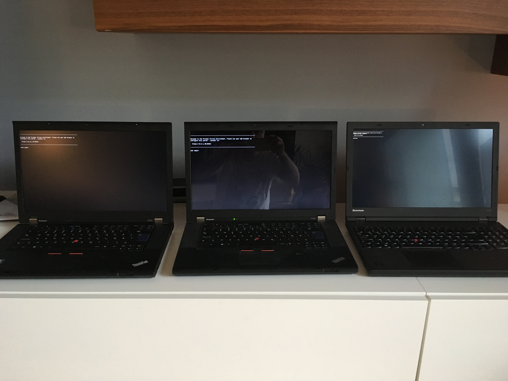
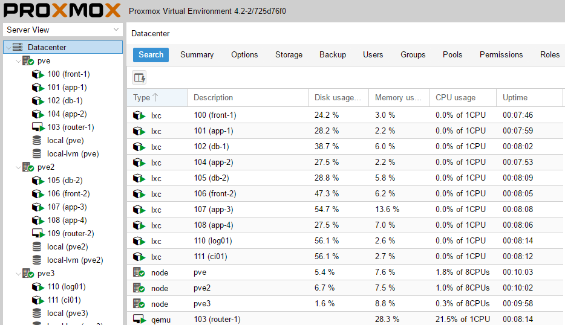
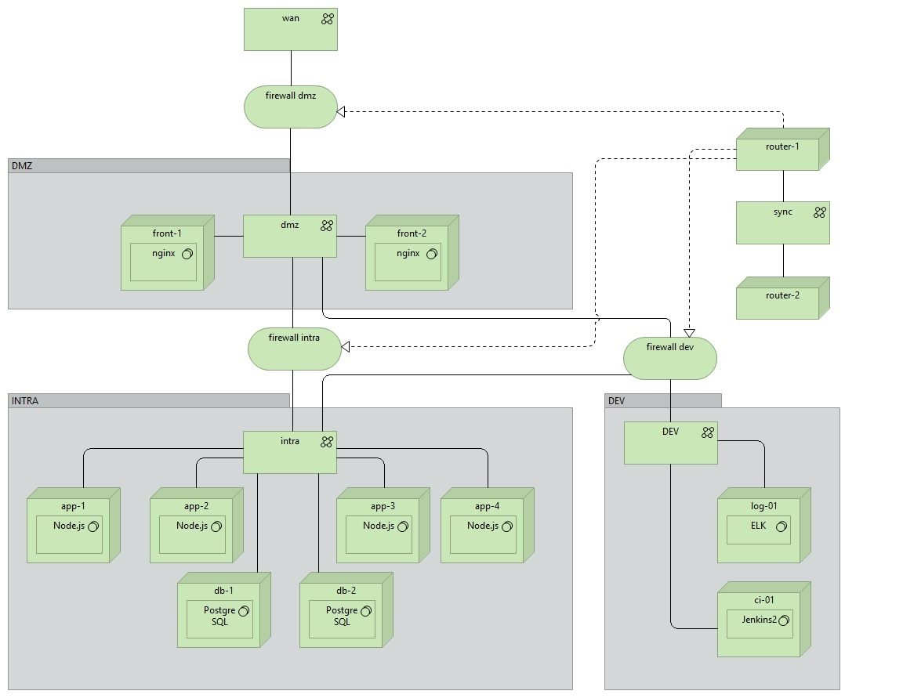

# Proxmox Virtual Environment
#### Puppet scripts for my home lab high-availability(HA) development environment.
My home lab environment for software development and infrastructure
that has a production like configuration that I use to learn and
practice on DevOps and software development. The setup is similar
to and handle some of the complexity that a IT-department would
need to meet the demands of a production, test and dev environment.

It configures a pretty standard high-availability environment with a
pair of reverse proxies that load balance in front of four backend
servers that has been divided in two clusters and using a primary
and hot-standby for stored state.

The network has been
separated into network zones for dmz and a internal corporate
network + more to emulate a production like environment.

#### Features
* clustered proxmox virtual environment on three machines.
* hardware failover with virtualized linux containers deployed on the proxmox cluster.
* firewall with failover.
* secured network, divided into separate vlan zones.
* database with failover.
* load balanced frontend servers.
* load balanced node backend server.
* immutable virtual servers.
* a sample web application.

## Hardware
Three retired work laptops, Lenovo W520 and W530 with 16GB ram
 and old school spinning hard drives connected with a Cisco
 switch with VLAN support, SG 200-08, for directing network
 traffic between them.

## Proxmox cluster on three nodes.
A screenshot from the Proxmox Web Admin. The three machines has
been added to the same cluster and can be managed through the
same admin console.

## Virtual machines overview with networks
This is how is looks like if modelled with Archimate and Archi.
I have modelled just the virtual machines, the networks and firewalls
that connect them.

## The sample application that is deployed
Is a very simple React application [Blogr](https://github.com/dniel/blogr-workshop)
that uses a Node Express backend and a PostgreSQL database for
persistence. Right now its deployed using the same puppet script
that install the configuration and system software but this
eventually be handled by Jenkins Pipeline.

## Installation
#### [Network configuration](doc/setup_network.md)
#### [Proxmox configuration](doc/setup_proxmox.md)
#### [Pfsense configuration](doc/setup_pfsense.md)
#### [lxc configuration](doc/setup_lxc.md)

## The Puppet Module
TODO: add detailed documentation about the puppet scripts, classes etc.

## Limitations
* Tested with Proxmox Virtual Environment 4.2-2/725d76f0.
* Virtual containers in Proxmox LXC installed with Debian 8.
* pfSense for firewall, gateway, routing, virtual ips of WAN, DMZ and LAN.
* A hardware network switch to route the vlans between different hardware nodes.
* Will not configure proxmox or pfsense, both must be manually installed and configured.

### Future development
* ELK collecting the log-files from all servers and applications.
* NAS, Network storage using iSCSI drive with multiple bays for configuring RAID failover on hard drives.
* Configure proxmox with puppet
* Configure pfSense with puppet
* Jenkins2 build server with Pipeline for deploying the Node Application to dev, test and production.
* Secured and hardened jump/login server to give access all virtal servers from remote login.