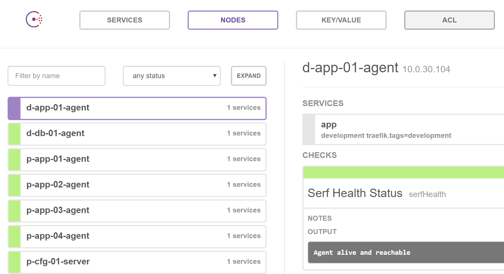
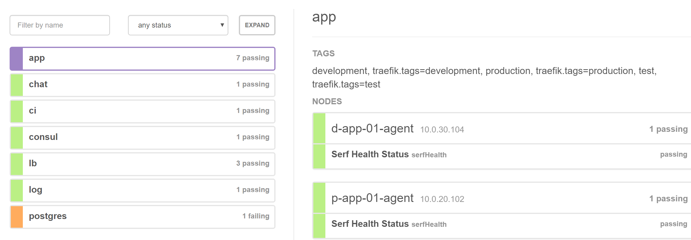

# Service Discovery
When implemented a distributed and clustered architecture that at the same time is as automated as possible, then 
a service discovery technology is a important part of the architecture. It enable us to scale up the number of 
instances running of a microservice across cluster nodes and as well the number running on each node in a 
dynamic way without manual configuration of new instances.

Two pieces of software must be installed for this to work
* Agents
* Central registry

The agents report status on the container they are installed on, and if any services are
defined on the node they also report back status on to the central catalog.

The central registry contain the status of all nodes and services that are defined.
Several products exists that provide this functionality
* Zookeeper used by Hadoop
* Etcd used by Kubernetes, together with registrator and confd.
* Consul

To enable Service Discovery in my home lab I'm using a product called Consul by HashiCorp.
One of the reasons that I chose Consul was that it is one of the products from [HashiCorp](https://www.hashicorp.com)
and I'm have a feeling that I'm going to explore more products from them in the future, like [Vault](https://www.vaultproject.io) and 
[Rancher](https://www.rancher.com).

As quoted from their [GitHub repo](https://github.com/hashicorp/consul)
> Consul is a tool for service discovery and configuration. Consul is distributed, highly available, and extremely scalable.
> Consul provides several key features:
> * Service Discovery - Consul makes it simple for services to register themselves and to discover other services via a DNS or HTTP interface. External services such as SaaS providers can be registered as well.
> * Health Checking - Health Checking enables Consul to quickly alert operators about any issues in a cluster. The integration with service discovery prevents routing traffic to unhealthy hosts and enables service level circuit breakers.
> * Key/Value Storage - A flexible key/value store enables storing dynamic configuration, feature flagging, coordination, leader election and more. The simple HTTP API makes it easy to use anywhere.
> * Multi-Datacenter - Consul is built to be datacenter aware, and can support any number of regions without complex configuration.


#### Health checks
I'm planning to use [monitoring-plugins](https://www.monitoring-plugins.org/) from Nagios in combination of
health checks from Consul to provide feedback when Nodes and Services. 

### Integrated into the puppet and build pipeline.
#### Jenkins pipeline
The [Jenkins Pipeline](/Jenkinsfile) that does scheduled runs for [Puppet Apply](/apply.sh) on all hosts use the 
[HTTP API of Consul](https://www.consul.io/docs/agent/http.html) to find all online hosts to apply on.

The [Jenkins Pipeline for the sample application](https://github.com/dniel/blogr-workshop/Jenkinsfile) also use 
the same HTTP API for Consul to find all hosts that run the [Sample Application](https://github.com/dniel/blogr-workshop)
and update them when running deploy.
 
#### Multiple environments 
When running the puppet scripts, depending on the hostname of the virtual container the [Puppet Apply](/apply.sh#L29) 
selects and set the puppet environment to be production, test or development. This is also used by the puppet scripts
to tag the Nodes and the Services with their environment.  

Example service names in Consul that work also as hostnames when querying Consul DNS.
 * test.postgres.service.consul
 * production.postgres.service.consul
 * development.app.service.consul

#### Puppet scripts
Included in all roles are the profile class [pve::profiles::config::agent](/manifests/profiles/config/agent.pp)
All server roles include this profile. Which also means that every container that are provisioned by puppet
does self register with consul when provisioning.


In the Consul web UI they will automatically appear like this  



And in the puppet script for different services,  for example the 
[Rest API for the sample app](/manifests/profiles/blogr/restapi.pp#L26)  



When for example doing an DNS lookup for the app.service.consul
in different environments I get the following answer.
```bash
$ dig @127.0.0.1 +short -p 8600 production.app.service.consul. ANY
10.0.20.104
10.0.20.103
10.0.20.102
$ dig @127.0.0.1 +short -p 8600 test.app.service.consul. ANY
10.0.30.102
10.0.30.101
$ dig @127.0.0.1 +short -p 8600 development.app.service.consul. ANY
10.0.30.104
```


#### Traefik, the load-balancer.
The first version of my home lab was using Nginx, then replaced by HAProxy, now recently replaced by 
[Traefik](http://www.traefik.io) has [native support for Consul](https://docs.traefik.io/toml/#consul-catalog-backend).


This give me the possibility to add a new LXC container, bootstrap the container and run the puppet apply.sh 
script, and if the role of the new container matches a service then it will be included in Consul, it will be 
added to the load balancer, found by the Jenkins pipeline Puppet Apply script used by Jenkins and the Jenkins 
Pipeline.
