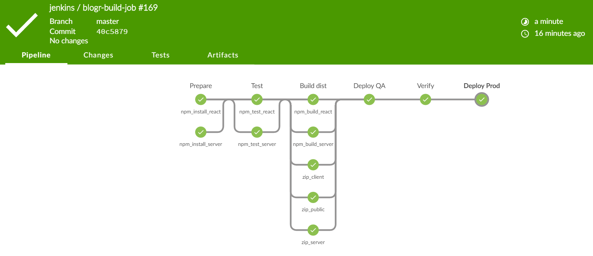
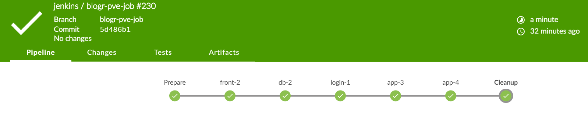

# Continuous integration
### continuous integration and deployment.
Three main components in the architecture enable us to perform continuous delivery, deployment and integration.
The Jenkins build server, Git version control system and automated tests of application.

### The deploy pipeline for the sample application
Jenkins is used both as a job scheduler, to provide a central place to monitor if scheduled processes run as planned.
Two pipelines has been implemented in Jenkins. The blogr-build-job that provide an automated, scheduled deployment
pipeline to all environments and that run automated tests in the build to avoid broken releases. It has no manual
input steps, if all tests is green the application is released to production.

### Puppet apply
 The blogr-pve-job is a scheduled job that run puppet apply on all servers

