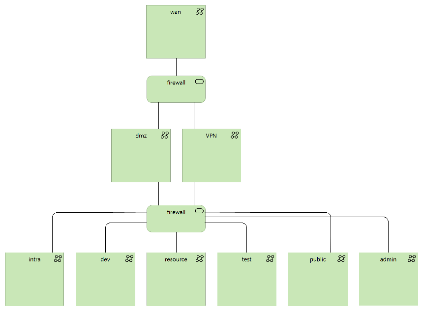

# Network setup
### Create the VLANS and assign to the correct ports on your switch.
Prepare communication between the laptops your switch/router
be configured to route a set of VLANS.

| VLAN          | Subnet        | Name          | Description  |
| ------------- | ------------- | ------------- |------------- |
| 2             | 10.0.2        | DMZ           | the internet facing vlan.            |
| 3             | 10.0.3        | INTRA         | the internal corporate network.              |
| 4             | 10.0.4        | SYNC          | the network pfSense instances uses to sync failover state.            |
| 5             | 10.0.5        | DEV           | the development infrastructure network, where Jenkins and ELK is configured.             |
| 6             | 10.0.6        | TEST          | the test servers that are used for acceptance tersting.             |

### Diagram
