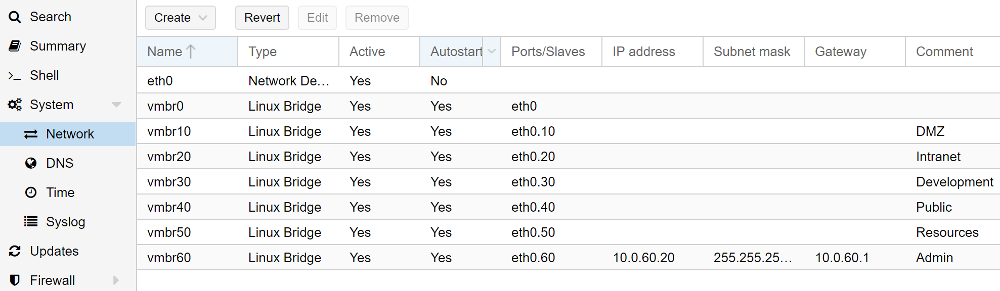

# PfSense setup
### Download, install and configure pfSense
* pfSense version > 2.3.1-RELEASE-p5
* Create a linux VM in Proxmox, install pfsense.
* Assign all virtual ethernet devices from proxmox to the qemu linux container.
* Create four interfaces in pfsense, DMZ and INTRA on two new subnets.

