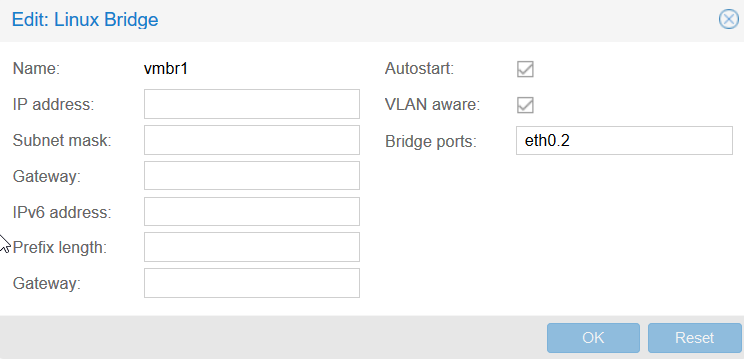

# Proxmox setup
### Download and install proxmox
Install Proxmox on all three laptops.
* Proxmox version > 4.2
* Create four virtual ethernet devices in proxmox.
* Tag the virtual ethernet devices with vlan tag 2,3,4 and 5

